<div align="center">



<br />


<br />

<a href="https://www.linkedin.com/in/kimlong-heng-638b1924b">
  
</a>


</div>

---

## Research Profile

```yaml
handle: 0xC0FF33
focus:
  - offensive security
  - malware research
practice:
  - HackTheBox
  - CTFtime player
languages:
  - Rust
  - C
  - Python
  - Bash
  - Lua
```

> I study how systems break, how malware behaves, and how offensive
> tradecraft can be understood responsibly. My goal is to build technical
> depth through labs, CTFs, research notes, and experiments.

## Arsenal

<p align="center">
  
</p>

<p align="center">
  
  
  
  
  
</p>

## Telemetry

<div align="center">


<br />


</div>

---

<div align="center">

<sub>Everything here is for authorized labs, defensive understanding, and responsible security research.</sub>

</div>
